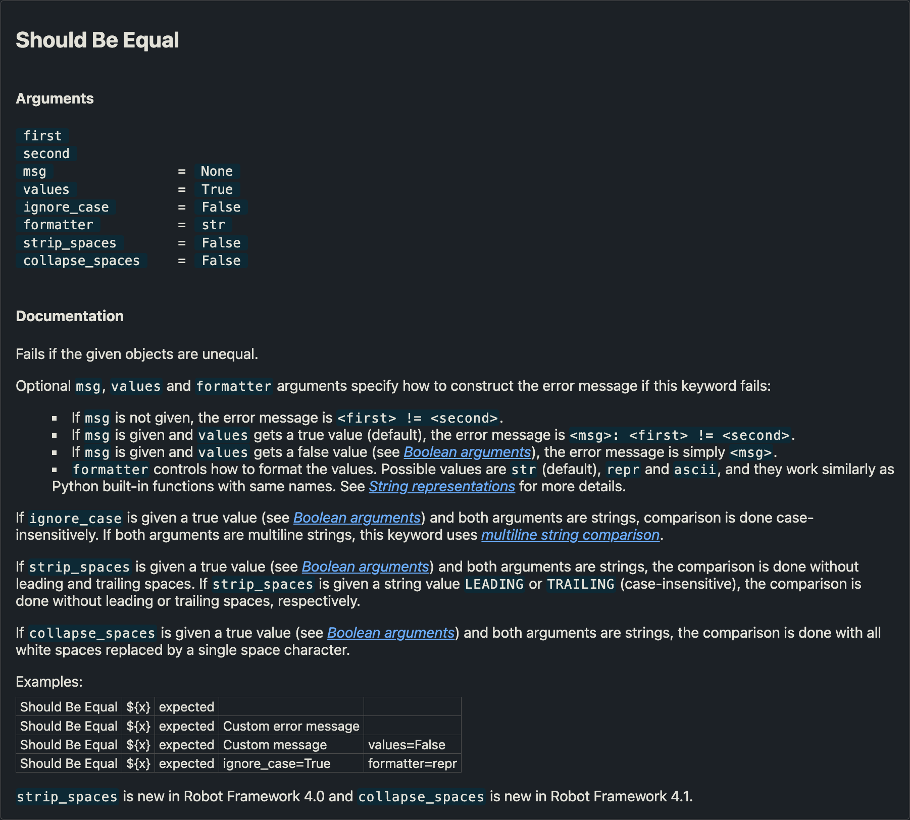

# 2 Getting Started with Robot Framework

This chapter introduces participants to the foundational concepts of Robot Framework.
It covers the basics of how automation specifications are structured, how suites are organized, and the execution process.
Participants will learn how Robot Framework is run and explore the generated reports and logs that document test results.

The chapter also provides an overview of suite structures,
the role of libraries and resource files,
and how to import them.
Additionally, it delves into the core syntax of Robot Framework,
focusing on how keywords are defined and used, the types of keyword arguments,
and how keyword documentation is interpreted to ensure clarity and maintainability.


## 2.1 Suite File & Tree Structure

> [!IMPORTANT]
> LO-2.1 Understand which files and directories are considered suites and how they are structured in a suite tree. (K2)

When executing Robot Framework, it either parses directory trees or files, depending on which paths are given.

The given path to Robot Framework where it starts parsing is considered the **Root Suite**.

If the path to a single file is given as **Root Suite** directly to Robot Framework, only this file is parsed.

If a directory path is given, starting at this location, Robot Framework will parse all `*.robot` files and directories within this path.
Robot Framework analyzes all containing files and determines if they contain test cases or tasks. If they do, they are considered **Suite Files** or **Low-Level Suites**.
All directories that either directly or indirectly contain a Suite File are considered **Suites Directories** or **Higher-Level Suites**.

The ordering of suites during execution is, by default, defined by their name and hierarchy.
All files and directories, which are suites in one directory, are considered on the same level and are executed in case-insensitive alphabetical order.


It is possible to define the order without influencing the name of the suite by adding a prefix followed by two underscores `__` to the name of the directory or file. This prefix is NOT considered part of the name.
So `01__First_Suite.robot` sets the suite name to `First Suite`, while `2_Second_Suite.robot` sets the suite name to `2 Second Suite`.

One or more underscores in file or directory names are replaced by space characters as suite names.

Legend:
```plaintext
▷ Directory (No Suite)
▶︎ Suite Directory
◻︎ File (No Suite)
◼︎ Suite File
```

Example:
```plaintext
 ----- Tree Structure / Order --------- | ---- Suite Name ---------
  ▶︎ Root_Suite                          | Root Suite
    ◼︎ A_Suite.robot                     | A Suite
    ▶︎ Earlier_Suite_Directory           | Earlier Suite Directory
      ◼︎ B_Suite.robot                   | B Suite
      ◼︎ C_Suite.robot                   | C Suite
    ▷ Keywords (No Suite)               |
      ◻︎ technical_keywords.resource     |
    ▶︎ Later_Suite_Directory             | Later Suite Directory
      ◼︎ 01__FirstSuite.robot            | First Suite
      ◼︎ 02__SecondSuite.robot           | Second Suite
      ▶︎ 03__ThirdSuite                  | Third Suite
        ◼︎ 01__FirstSubSuite.robot       | First Sub Suite
        ◼︎ 02__SecondSubSuite.robot      | Second Sub Suite
      ◼︎ 04__FourthSuite.robot           | Fourth Suite
```


### 2.1.1 Suite Files

> [!IMPORTANT]
> LO-2.1.1 Recall the conditions and requirements for a file to be considered a Suite file (K1)

Robot Framework parses files with the extension `.robot` and searches for test cases or tasks within these files.

A parsed file that contains at least one test case or task is called a **Suite File**.

A Suite File **either** contains `*** Test Cases ***` (in Test Suites) **or** `*** Tasks ***` (in Task Suites), but it CANNOT contain both types simultaneously.


### 2.1.2 Sections and Their Artifacts

> [!IMPORTANT]
> LO-2.1.2 Recall the available sections in a suite file and their purpose. (K1)

Robot Framework data files are defined in different sections.
These sections are recognized by their header row.
The format is `*** <Section Name> ***` with three asterisks before and after the section name and section names in *Title Case* separated by a space.

The following sections are recognized by Robot Framework and are recommended to be used in the order they are listed:
- `*** Settings ***`
- `*** Variables ***`
- `*** Test Cases ***` or `*** Tasks ***` (mandatory in Suite Files)
- `*** Keywords ***`
- `*** Comments ***`

The sections `*** Settings ***`, `*** Variables ***`, `*** Keywords ***`, and `*** Comments ***` are optional in suites and can be omitted if not needed.


#### 2.1.2.1 `*** Settings ***` Section

> [!IMPORTANT]
> LO-2.1.2.1-1 Recall the available settings in a suite file. (K1)
>
> LO-2.1.2.1-2 Understand the concepts of suite settings and how to define them. (K2)

This section is used to configure various aspects of the test|task suite.
It allows you to import keywords from external libraries (`Library`) or resource files (`Resource`), and import variables (`Variables`) from variable files (Not part of this syllabus) that are needed for execution in the containing tests|tasks.

In this section, the suite name, that is normally derived from the file name, can be redefined with the `Name` setting and its documentation can be defined with the `Documentation` setting.

Additional metadata can be defined by multiple `Metadata` entries, which can containd key-value pairs that can be used to store additional information about the suite, like the author, the version, or related requirements of the suite.

This section can also define keywords called for execution flow control, such as `Suite Setup` and `Suite Teardown`, which are executed before and after the suite's tests run. See [4.1 Setups (Suite, Test|Task, Keyword)](Chapter_4_Advanced_Structuring_and_Execution.md#41-setups-suite-testtask-keyword) and
[4.2 Teardowns (Suite, Test|Task, Keyword)](Chapter_4_Advanced_Structuring_and_Execution.md#42-teardowns-suite-testtask-keyword) for more information.

Additionally, some settings can define defaults for all tests|tasks in the suite, which can be extended or overwritten in the individual tests|tasks.
Those settings are prefixed with either `Test` or `Task`, according to the type of suite and the following section type (`*** Test Cases ***` or `*** Tasks ***`), like `Test Timeout`, while the local setting is in square brackets and without the prefix like: `[Timeout]`.


- `Test Setup`/`Task Setup` (locally: `[Setup]`) and `Test Teardown`/`Task Teardown` (locally `[Teardown]`) define which keywords are executed before and after each individual test|task. The local setting overrides the suite's default. See [4.1 Setups (Suite, Test|Task, Keyword)](Chapter_4_Advanced_Structuring_and_Execution.md#41-setups-suite-testtask-keyword) and
[4.2 Teardowns (Suite, Test|Task, Keyword)](Chapter_4_Advanced_Structuring_and_Execution.md#42-teardowns-suite-testtask-keyword) for more information.

- `Test Timeout`/`Task Timeout` (locally `[Timeout]`) defines the maximum time a test|task is allowed to run before it is marked as failed. The local setting overrides the suite's default.

- `Test Tags`/`Task Tags` (locally `[Tags]`) define tags that are assigned to tests|tasks in the suite and can be used to filter tests|tasks for execution or for attributing information to the tests|tasks. The local setting appends or removes tags defined by the suite's default. See [4.4 Test|Task Tags and Filtering Execution](Chapter_4_Advanced_Structuring_and_Execution.md#44-testtask-tags-and-filtering-execution) for more information.

- `Test Template`/`Task Template` (locally `[Template]`) defines a template keyword that defines the test|task body and is typically used for Data-Driven Testing where each test has the same keywords but different argument data. The local setting overrides the suite's default.

Similar to test|task tags, also keyword tags can be defined in the `*** Settings ***` section with the `Keyword Tags` (locally `[Tags]`) setting, which can be used to set keyword tags to the keywords. The local setting appends or removes tags defined by the suite's default.


#### 2.1.2.2 `*** Variables ***` Section

> [!IMPORTANT]
> LO-2.1.2.2 Recall the purpose of the `*** Variables ***` section. (K1)

This section is used to define suite variables that are used in the suite or its tests|tasks or inside their keywords.

The most common use case is to define these variables as constants that contain a static value during execution.
This can either be a default value, that may be overwritten by globally defined variables via the Command Line Interface (CLI) or a constant value that is used on multiple places in the suite.

In some cases, these variables are also dynamically reassigned during the execution of the suite, but this is not recommended and should be avoided if possible, because this may lead to test|task runtime dependancies and errors caused by these side-effects that are hard to debug and find.

See [3.2.2 `*** Variables ***` Section](Chapter_3_Keyword_Design_Variables_Resources.md#322--variables--section) for more information about the `*** Variables ***` section.


#### 2.1.2.3 `*** Test Cases ***` or `*** Tasks ***` Section

> [!IMPORTANT]
> LO-2.1.2.3 Understand the purpose of the `*** Test Cases ***` or `*** Tasks ***` section. (K2)

This section defines the executable elements of a suite.
Test cases and tasks are technically synonyms for each other.
However, users have to choose one of the two modes of suite execution that Robot Framework offers.

Each test case or task is structured using an indentation-based format. The first un-indented line specifies the name of the test|task, followed by indented lines containing **keyword calls** and their **arguments** and test|task-specific settings.
These optional settings like `[Setup]`, `[Teardown]`, and `[Timeout]` can be applied to individual test cases or tasks to control their behavior or provide additional details.

One kind of this section is mandatory in suite files but is not allowed in resource files.

See [2.6 Writing Test|Task and Calling Keywords](Chapter_2_Getting_Started.md#26-writing-testtask-and-calling-keywords) for more information about the `*** Test Cases ***` or `*** Tasks ***` section.

<!-- TODO maybe more references to Test Setup/Teardown or Documentation? -->

#### 2.1.2.4 `*** Keywords ***` Section

> [!IMPORTANT]
> LO-2.1.2.4 Understand the purpose and limitations of the `*** Keywords ***` section. (K2)

This section allows you to define **locally scoped user keywords** that can only be used within this suite where they are defined,
while keywords defined in resource files can be used in any suite that imports these resource files.
Keywords defined in a suite are therefore not reusable outside the suite,
but they are often used to organize and structure tests|tasks for improved readability and maintainability.
This section is particularly useful for defining suite-specific actions,
such as **Suite Setup** keywords or similar kinds,
which are relevant only to the suite they belong to.

While these keywords are not globally accessible,
they serve a crucial role in making the suite more modular
and understandable by breaking down complex sequences into smaller, manageable parts.
Defining keywords locally in this section enhances the maintainability of the tests|tasks within the suite,
ensuring that even large and intricate suites remain well-structured and easy to manage.

See [3.3.1 `*** Keywords ***` Section](Chapter_3_Keyword_Design_Variables_Resources.md#331--keywords--section) for more information about the `*** Keywords ***` section.


#### 2.1.2.5 `*** Comments ***` Section

This section is used to add comments to the suite file or resource file.
All content in this section is ignored by Robot Framework and is not executed or parsed.


## 2.2 Basic Suite File Syntax

<!--
TODO:
I think this section needs a bit more structure and we should introduce the concept of "settings" like [Documentation] already here and reference to Chapter 4.

 -->

> [!IMPORTANT]
> LO-2.2 Understand the basic syntax of test cases and tasks. (K2)


### 2.2.1 Separation and Indentation

> [!IMPORTANT]
> LO-2.2.1 Understand and apply the mechanics of indentation and separation in Robot Framework. (K3)

As mentioned before, Robot Framework uses an indentation-based and space-separated syntax to structure keywords, test cases, and tasks.

**Two or more spaces** are used to separate or indent statements in Robot Framework files, while a single space is a valid character in tokens (i.e. keyword names, argument values, variables, etc.).
The clear recommendation for separators is to use **four spaces** or more to unambiguously make it visible
to a potential reader where elements are separated or indented.

A statement in Robot Framework is a logical line that contains specific data tokens which are separated by multiple spaces (separator token) from each other.

**Example 1**: A keyword call is a statement that consists of a keyword name and its arguments, which are separated by two or more spaces from the keyword name and from each other.
An optional assignment of the return value can be possible as well.
The line comments starting with a hash `#` show the tokens in the statement.

Example with tokens in comments:
```robotframework
*** Test Cases ***
# TESTCASE HEADER |
Test Case Name
# TESTCASE   | EOL
      Keyword Call     argument one     argument two
# SEP |  KEYWORD | SEP | ARGUMENT | SEP | ARGUMENT | EOL
      Keyword Call
# SEP |  KEYWORD | EOL
      ...            argument one
# SEP | CONTINUATION | ARGUMENT | EOL
      ...            argument two
# SEP | CONTINUATION | ARGUMENT | EOL
      ${variable_assignment}     Keyword Getter Call
# SEP |     ASSIGNMENT     | SEP |     KEYWORD     | EOL
```

Plain example for better readability:
```robotframework
*** Test Cases ***
Test Case Name
      Keyword Call     argument one     argument two
      Keyword Call
      ...            argument one
      ...            argument two
      ${variable_assignment}     Keyword Getter Call
```

In the example above, the test case `Test Case Name` contains three keyword calls.
The first keyword call `Keyword Call` has two arguments, `argument one` and `argument two`.
The second keyword call even though it is split over two lines is considered one logical line and identical to the first keyword call.
The third keyword call is a keyword call that assigns the return value of the keyword `Keyword Getter Call` to the variable `${variable_assignment}`.

**Example 2**: In the `*** Settings ***` section, the settings are separated from their values by four or more spaces.

```robotframework
*** Settings ***
# SETTINGS HDR |
Documentation     This is the first line of documentation.
#  SETTING  | SEP |                 VALUE                | EOL
...   # just CONTINUATION and End Of Line
...            This is the second line of documentation.
# CONTINUATION |                VALUE                  | EOL
Resource     keywords.resource
# SET  | SEP |     VALUE     | EOL
```


All elements themselves in their section are written without any indentation.
So settings in the `*** Settings ***` section, test cases in the `*** Test Cases ***` section,
and keywords in the `*** Keywords ***` section are written without any indentation.
However, when defining tests|tasks and keywords, indentation is used to define their body, while their name is still un-indented.
So after i.e. a test case name, all subsequent lines that are part of the test case body are indented by two or more spaces.

That means that a body statement always starts with a separator token, followed by a data token, like i.e. variable or keyword as seen in the examples above.

The body ends when either a new un-indented test case name is defined
or another section like `*** Keywords ***` starts
or the end of the file is reached.

Within the body of tests|tasks and keywords, control structures like loops or conditions can be used. Their content should be indented by additional four spaces to make it clear that they are part of the control structure. However, this is not mandatory and only a recommendation to make the file more readable.

While single tabulators (`\t`) as well as two or more spaces are valid separators,
it is recommended to use multiple spaces for indentation and separation and avoid tabulators.
This can prevent issues where different editors align text to a grid (e.g., 4 spaces) when using tabs,
making it difficult for users to distinguish between tabs and spaces.
It could cause a single tabulator to look the same as a single space in the editor,
which would lead to misinterpretation of the file structure by a human reader.


### 2.2.2 Line Breaks, Continuation and Empty Lines

> [!IMPORTANT]
> LO-2.2.2 Be able to use line breaks and continuation in a statement. (K3)

Empty lines are allowed and encouraged to structure data files and make them more readable.
In the next example, the sections are visibly separated by two empty lines, and the tests are separated by one empty line.
Empty lines are technically not relevant and are ignored while parsing the file.


By default, each statement in a suite or resource file is terminated by a line break, so that in each literal line only one statement is possible.
However, for better readability or in the case of documentation for adding line breaks, expressions can expand over multiple literal lines if they are continued with `...` (three dots) and a separator (multiple spaces) at the beginning of the next line, potentially being indented. See the suite documentation as an example.

With this line continuation between two data tokens, the two literal lines are interpreted as one logical line and do result in one statement.

A line continuation can only be performed where a separator is expected, like between a keyword name and its arguments or between two arguments or between a setting and its value(s).
In the following example the two keyword calls are logically identical, even though the second one is split over three literal lines.

**Example**:

### 2.2.3 In-line Comments

> [!IMPORTANT]
> LO-2.2.3 Be able to add in-line comments to suites. (K3)

In Robot Framework comments can be added to lines after the content
by starting the comment with a separator (multiple spaces) and a hash `#`.
The hash `#` is used to indicate that the rest of the line is a comment and is ignored by Robot Framework.
Same works at the very start of a line, which makes the whole line a comment.

Hashes in the middle of a value are considered normal characters and do not need to be escaped.

If an argument value or any other thing shall start with a hash (`#`)
and it is preceded by a separator (multiple spaces),
the hash must be escaped by a backslash `\` like `Click Element By Css    \#element_id`.

Block comments are not supported in Robot Framework,
so each line that shall be a comment must be prefixed with a hash `#`.
Alternatively the `*** Comments ***` section can be used to add multi-line comments to files.


### 2.2.4 Escaping of Control Characters

> [!IMPORTANT]
> LO-2.2.4 Understand how to escape control characters in Robot Framework. (K2)

In Robot Framework strings are not quoted which leads to situations where users need to be able to define,
if a specific character shall be interpreted as part of the value or as a control character.


Some examples are:
- the `#` hash character that is used to start a comment as described above.
- variables that are started by i.e. `${` (See [3.2 Variables](Chapter_3_Keyword_Design_Variables_Resources.md#32-variables))
- multiple spaces that are considered as separators
- equal sign `=` that is used to assign named arguments to keywords

All those characters or character sequences that are interpreted as control characters can be escaped by a backslash `\`.
This means that the character following the backslash is interpreted as a normal character and not as a control character.

This leads to the fact that a backslash itself must be escaped by another backslash to be interpreted as a normal  backslash character. Therefore it is strongly recommended to use forward slashes `/` as path separators in paths also on windows environments and avoid backslashes `\` when ever possible.

Leading and trailing spaces in values are normally considered being part of the separator surrounding the values.
If values shall contain leading or trailing spaces they must be either enclosed in backslashes `\` or replaced by the special variable `${SPACE}` that contains a single space character.

Example:
```robotframework
*** Test Cases ***
Test of Escaping
    Log    \# leading hash.                     # This logs "# leading hash."
    Log    \ lead & trail \                     # This logs " lead & trail "
    Log    ${SPACE}and now 5 More: \ \ \ \ \    # This logs " and now 5 More:     "
    Log    Not a \${variable}                   # This logs "Not a ${variable}"
    Log    C:\\better\\use\\forward\\slashes    # This logs "C:\better\use\forward\slashes"
```


### 2.2.5 Example Suite File

> [!IMPORTANT]
> LO-2.2.5 Understand the structure of a basic suite file. (K2)

In the following example, two test cases are defined in a suite file.
- `Login User With Password`
- `Denied Login With Wrong Password`

Both test the login functionality of a system by calling four keywords in their bodies.

In the `*** Settings ***` section, the suite is documented, and the keywords for connecting to the server, logging in, and verifying the login are imported from a resource file.
The settings of this section are not indented, but their values are separated by four or more spaces.

In the `*** Test Cases ***` section, there are two test cases defined.
The first test case, `Login User With Password`, connects to the server, logs in with the username `ironman` and the password `1234567890`, and verifies that the login was successful with the user's name `Tony Stark`.
In this test, the first called keyword is `Connect To Server` without any arguments, while the second called keyword is `Login User`, and it has two argument values: `ironman` and `1234567890`.

The second test case, `Denied Login With Wrong Password`, connects to the server, tries to log in with the username `ironman` and the password `123`, and expects an error to be raised and the login to be denied.

Clearly visible due to the indentation by four spaces, the body of the test cases contains the keywords that are called to execute the test case.
In the test case body, some keyword calls have arguments that are separated by two or more spaces from the keyword name.

The following tests will be executed in the order they are defined in the suite file. First, the `Login User With Password` test case will be executed, followed by the `Denied Login With Wrong Password` test case.

Example Suite File Content `robot_files/TestSuite.robot`:
```robotframework
*** Settings ***
Documentation     A suite for valid and invalid login tests.
...
...               Keywords are imported from the resource file.
Resource          keywords.resource


*** Test Cases ***
Login User With Password
    Connect To Server
    Login User            ironman    1234567890   # Login with valid credentials
    Verify Valid Login    Tony Stark   # Verify that the login was successful by checking the user name
    Close Server Connection

Denied Login With Wrong Password
    Connect To Server
    Run Keyword And Expect Error    # this keyword calls another keyword and expects an error
    ...        *Invalid Password*   # it expects an error containing `Invalid Password`
    ...        Login User           # this keyword is called with two arguments
    ...        ironman
    ...        123#wrong            # A hash in the middle of a string is not a comment
    Verify Unauthorized Access
    Close Server Connection
```


## 2.3 Executing Robot

> [!IMPORTANT]
> LO-2.3 Recall the three components of the Robot Framework CLI. (K1)

Robot Framework comes with three executables when being installed which are designed to be used via the command-line interface (CLI).

- `robot` is the main executable that is used to execute suites.
- `rebot` is used to post-process execution results and generate reports. (covered in a later chapter)
- `libdoc` is used to generate keyword documentation for libraries and resource files. (covered in a later chapter)


### 2.3.1 `robot` command & help

> [!IMPORTANT]
> LO-2.3.1 Understand how to run the `robot` command and its basic usage. (K2)

The `robot` command is used to run a Robot Framework execution, which will execute suites and their containing tests|tasks.

At a basic level, you can run `robot` by providing the path to a suite file or suite directory containing suite files as last argument.
```plaintext
robot <path_to_root_suite>
```

In case of the above given example where a single suite file named `TestSuite.robot` is stored in a directory `robot_files`, to execute the example test suite the following command is used, if the current working directory of the terminal is the directory containing the `robot_files` directory:
```plaintext
> robot robot_files
```

This command starts the Robot Framework execution by first parsing all files in the given directory tree that have the extension `.robot`,
then creating an execution model and then executing all suites and test cases in that model.
During execution, the results of each test case are printed to the console and at the end a summary is printed and reports are generated.

Example Console Output:
```plaintext
> robot robot_files
==============================================================================
Robot Files
==============================================================================
Robot Files.TestSuite :: A test suite for valid login.
==============================================================================
Login User With Password                                              | PASS |
------------------------------------------------------------------------------
Denied Login With Wrong Password                                      | PASS |
------------------------------------------------------------------------------
Robot Files.TestSuite :: A test suite for valid login.                | PASS |
2 tests, 2 passed, 0 failed
==============================================================================
Robot Files                                                           | PASS |
2 tests, 2 passed, 0 failed
==============================================================================
Output:  /path/to/output.xml
Log:     /path/to/log.html
Report:  /path/to/report.html
```

The `robot` command can optionally be configured with additional options to control the execution behavior, such as setting output formats, specifying specific tests to run, or controlling logging levels and many more. These options are named arguments that are passed to the `robot` command BEFORE the path to the suite file or directory. To learn more about these options, you can use the help of the `robot` command like: `robot --help`.


### 2.3.2 Execution Artifacts

> [!IMPORTANT]
> LO-2.3.2 Explain the execution artifacts generated by Robot Framework. (K2)

After executing a suite, Robot Framework, by default, generates tree output files in the output directory. These artifacts provide detailed execution results:

- **`output.xml`**: A machine-readable file containing **ALL** logged execution details, limited by the given log-level.
- **`log.html`**: A detailed log file that provides an HTML view of the execution, including keyword-level details.
- **`report.html`**: A summary report that gives an overview of the execution results, including statistics of tests|tasks executed, passed, and failed.

`log.html` and `report.html` are generated based on the information stored in `output.xml`.

A unique feature of Robot Framework is, that it logs each keyword call and its arguments with its log outputs and timestamps, so that it is possible to have a very detailed view of the execution flow and the data that was used during the execution.
In case of a failure it is possible to see the exact keyword call that failed and the arguments that were used, which can be very helpful for debugging or reporting. Furthermore you also get all passed keywords and even the non-executed keywords to protocol the whole execution flow.


### 2.3.3 Status

> [!IMPORTANT]
> LO-2.3.3 Recall the four different status labels used by Robot Framework. (K1)

Robot Framework uses different status labels to indicate the result of an execution:

On Suite, Test Case and Task Level:
- **`PASS`**: Indicates that the item was successfully executed without unexpected errors.
- **`FAIL`**: Shows that the item encountered an error and did not pass.
- **`SKIP`**: Indicates that the item was intentionally skipped, i.e. due to external factors like preconditions not being met.

Additional Keyword Status:
- **`NOT RUN`**: Refers to keywords that were not executed during execution, i.e. due to previous failure or conditions.

`NOT RUN` and `SKIP` are explained in more detail in later chapters.

**Atomic elements** like Library Keywords or Robot Framework language statements do define their own status.

**Composite elements** like suites (composed of tests|tasks), tests|tasks (composed of keywords) and User Keywords (composed of Library Keywords and Robot Framework statements) do define their status based on the status of their child elements.


#### 2.3.3.1 PASS

> [!IMPORTANT]
> LO-2.3.3.1 Understand when an element is marked as `PASS`. (K2)

This status is used if an element was executed successfully without any errors or exceptions.

**Atomic elements** are `PASS` if they were executed successfully without reporting an error by raising an exception.

**Composite elements** are `PASS` if all their executed body elements are pass.
In example for User Keywords this means that if all keywords or Robot Framework language statements that were directly called by that User Keyword were `PASS` the User Keyword itself is considered `PASS`.

Library Keywords like `Run Keyword And Expect Error`, from BuiltIn Library, do `PASS` if the keyword they are internally calling does raise an error with the expected message or type.

That means that a composite element like suite, test|task or User Keyword may be `PASS` even if some of its deeper child elements are `FAIL`.


#### 2.3.3.2 FAIL

> [!IMPORTANT]
> LO-2.3.3.2 Understand when an element is marked as `FAIL`. (K2)

This status is used if an element was executed but encountered an error or exception that was not expected.

A failure typically causes the subsequent keywords to be skipped.
Exceptions are Teardowns explained in chapter [Advanced Structureing and Execition](Chapter_4_Advanced_Structuring_and_Execution.md).

**Atomic elements** are `FAIL` if they were tried to be executed but raised an exception.

**Composite elements** are `FAIL` if at least one of their executed direct body elements are `FAIL`.
Therefore a failure typically distributes upwards through the hierarchy of elements until it reaches the root suite.

A User Keywords is `FAIL` if one of its called Library Keywords is `FAIL`.
A test|task is `FAIL` if one of its directly called Keywords is `FAIL`.
A suite (file) is `FAIL` if one of its test|task is `FAIL` and
a suite (directory) is `FAIL` if one of its suites (file) is `FAIL`.


### 2.3.4 Logging possibilities (Log vs Console)

> [!IMPORTANT]
> LO-2.3.4 Understand the difference between log messages and console output. (K2)

There are basically two kinds of logging information in Robot Framework.

- **Console Output**: The console output is the output that is printed to the terminal where the `robot` command was executed. It is typically not persistent but can be already seen during execution.
- **Log Messages**: Log messages are written to the `output.xml` and therefore also `log.html` file and are persistent. They are typically created by the Library Keywords that are executed and can be used to log information about the execution. Also Robot Framework itself does log information to the `output.xml` like assigned values of arguments or the return values of keywords.

Log messages can be written with different levels of severity like i.e. `INFO`, `DEBUG`, `TRACE`, `WARN` or `ERROR`.
Which levels are written to the log can be controlled by the log level of an execution. Further information in later chapters.


## 2.4 Keyword Imports

<!-- To use Keywords that are not part of BuiltIn, which is always imported invisibly, you must import keywords into the current scope. Basically Two different sources of keywords.
- Libraries, which contains low-level keywords actually implementing functionality, typically in Python.
- Resource Files, which either again import libraries or other Resource Files or they specify User Keywords.  -->
Robot Framework has a modular design that allows users to import keywords from external sources.
Without importing external keywords into a suite, only the keywords from Robot Framework's BuiltIn library are available for use, due to them being imported automatically.
Also the Robot Framework language statements itself are available for use without importing it.

External keywords can be imported from either libraries or resource files.
Both types of sources are using different syntax to import their keywords.


### 2.4.1 Libraries

> [!IMPORTANT]
> LO-2.4.1-1 Recall the purpose of keyword libraries and how to import them. (K1)
>
> LO-2.4.1-2 Recall the three types of libraries in Robot Framework. (K1)

From a user perspective there are three different kinds of libraries:
- **Robot Framework Standard Libraries**: These are libraries that are shipped with Robot Framework and are available without any additional installation. See documentation of [ext: Robot Framework Standard Libraries](https://robotframework.org/robotframework/#standard-libraries) for more information.
- **3rd Party Libraries** / **External Libraries**: These are libraries have been developed and maintained by community members and have to be installed/downloaded separately.
- **Custom Libraries**: These libraries are developed by the users themselves to solve specific problems or to encapsulate more complex functionality.

Further more detailed information about the different types of libraries and are described in later chapters.
<!-- TODO: Do we fulfill this promise? -->

To import a library into a suite or resource file the `Library` setting is used in the `*** Settings ***` section followed by the name of the library as long as they are located in the Python module search path, which automatically happens if they are installed via `pip`.
The name of the library is case-sensitive and should be taken from the library's keyword documentation.
By default, libraries in Robot Framework are implemented in Python and the name of the library is the name of the Python module that contains the library implementation.

Alternatively, if a library is not in Python module search path, a library can be imported using the path to the Python module. See [2.4.3 Import Paths](Chapter_2_Getting_Started.md#243-import-paths).

Be aware that the library [`BuiltIn`](https://robotframework.org/robotframework/latest/libraries/BuiltIn.html) is always imported invisibly and does not need to be imported explicitly.

Example:
```robotframework
*** Settings ***
Library    OperatingSystem
Library    Browser
Library    DatabaseLibrary
```

Once a library is imported, all keywords from that library are available for use in that suite or resource file.
Which keywords are available can be seen in the keyword documentation of the library or may be visible in the IDE by code completion, depending on the IDE extension being used.


### 2.4.2 Resource Files

> [!IMPORTANT]
> LO-2.4.2-1 Recall the purpose of resource files. (K1)
>
> LO-2.4.2-2 Use resource files to import new keywords. (K3)

As mentioned before resource files are used to organize and store keywords and variables that are used in multiple suites.

They share a similar structure and the same syntax as suite files, but they do not contain test cases or tasks.
See [2.2 Basic Suite File Syntax](Chapter_2_Getting_Started.md#22-basic-suite-file-syntax) for more information about the structure of suite files.

They can contain other keyword imports, which cause the keywords from the imported libraries or resource files to be available in the suites where the resource file is imported. Same counts for variables that are defined and imported from other resource files.
Therefore keywords from a library that have been imported in a resource file are also available in the suite that imports that resource file.

To import a resource file into a suite or resource file the `Resource` setting is used in the `*** Settings ***` section followed by the path to the resource file.
See [2.4.3 Import Paths](Chapter_2_Getting_Started.md#243-import-paths) for more information about the path to the resource file.

Resource files shall have the extension `.resource` to make it clear what they are.
`.resource` and `.robot` extensions are also recognized by IDE extensions, supporting Robot Framework.

Example:
```robotframework
*** Settings ***
Resource    local_keywords.resource
Resource    D:/keywords/central_keywords.resource
```

See more about the structure of resource files in
[3.1 Resource File Structure](Chapter_3_Keyword_Design_Variables_Resources.md#31-resource-file-structure)
and how keywords and variables are created in the sections following that.


### 2.4.3 Import Paths

> [!IMPORTANT]
> LO-2.4.3 Understand the different types of paths that can be used to import libraries and resource files. (K2)

When importing libraries or resource files via a path, the path can be either an absolute path or a relative path.
If a relative path is given, the path is resolved relative to the data file that is importing the library or resource file.

If an **absolute path** is given, the resource file or library is searched for at the given path.

If a **relative path** is given, the resource file or library is searched for relative to the data file that is importing it and then relative to the Python *module search path*.
This *module search path* is define by the Python interpreter that executes Robot Framework and can be influenced by the environment variables `PYTHONPATH` or using the CLI-Argument `--pythonpath` when executing `robot`.

As **path separator** it is strongly recommended to always use forward slashes `/`, and even on Windows NOT use back-slashes `\`.
This is due to the fact that back-slashes are used as escape characters in Robot Framework and can lead to issues when used in paths and forwards slashes are supported on all operating systems.

When choosing the location of resource files or libraries, it should be taken into that consideration that absolute paths are typically not portable and therefore should be avoided.
Relative paths are portable as long as they are related to the data file that is importing using them, as long as that relative path is part of the project structure.

However the most stable and recommended way is to use the **Python Path/module search path** to import them.
That path needs to be defined when executing Robot Framework but can lead to more uniform and stable imports, because each suite or resource file can be use the same path to import the same resource file or library, independent of the location of the importing suite or resource file.


## 2.5 Keyword Interface and Documentation

> [!IMPORTANT]
> LO-2.5 Understand the structure of keyword interfaces and how to interpret keyword documentation. (K2)

Library Keywords and User Keywords that are defined in a resource file should have a documentation text that describes what the keyword does and how it should be used.

Robot Framework is capable of generating a **Keyword Documentation** files that contains a library- or resource-documentation, all keywords, their argument interfaces, and their documentation texts.
This documentation file can be generated with the `libdoc` command and can be used to provide a reference for users who want to use the keywords.

Basically all standard and external 3rd party libraries offer these Keyword Documentations as online available HTML pages.

Robot Framework offers the Keyword Documentation of its Standard Libraries at https://robotframework.org/robotframework .

<!-- Keywords from Libraries and Resources can be called and can be documented either as HTML or in IDEs with Robot Support. -->


### 2.5.1 Documented Keyword Information

> [!IMPORTANT]
> LO-2.5.1 Recall the information that can be found in a keyword documentation. (K1)

The Keyword Documentation is structured so, that it contains first the library or resource documentation, followed by a list of all keywords that are available in that library or resource file.

Each library or resource documentation can contain the following information sections for keywords:
- **Name**: The name of the keyword as it is called.
- **Arguments** (opt.): The argument interface that the keyword expects/offers its types and default values.
- **Return Type** (opt.): The type of the return value of the keyword.
- (*) **Tags** (opt.): The tags that are assigned to the keyword to categorize keywords.
- **Documentation** (opt.): The documentation text that describes what the keyword does and how it should be used.

(*) Understanding keyword tags is not part of the syllabus.

The following keywords are part of the Standard Libraries of Robot Framework.
Their documentation has been generated by the Robot Framework tool `libdoc` which is included in Robot Framework.

#### 2.5.1.1 Example Keyword `Should Be Equal`

[Documentation of `Should Be Equal` from `BuiltIn` library](https://robotframework.org/robotframework/latest/libraries/BuiltIn.html#Should%20Be%20Equal)

`Should Be Equal` is part of the BuiltIn library and is documented as follows:



This keyword has 2 "Mandatory Arguments" and 6 "Optional Arguments".
All of them can be called positionally or by name.


#### 2.5.1.2 Example Keyword `Run Process`

[Documentation of `Run Process` from `Process` library](https://robotframework.org/robotframework/latest/libraries/Process.html#Run%20Process)

`Run Process` is part of the Process library and is documented as follows:


This keyword has one "Mandatory Arguments" `command` which can be called positionally or by name.
The latter two arguments are optional.

The argument `arguments` is a "Variable Number of Positional Arguments" and can only be set by position.
Therefore, if it shall be set, all preceding arguments must be set by position as well.
See [2.5.2.5 Variable Number of Positional Arguments](Chapter_2_Getting_Started.md#2525-variable-number-of-positional-arguments) for more information about this kind of argument.

The argument `configuration` is a "Free Named Argument" and can only be set by names.
See [2.5.2.7 Free Named Arguments](Chapter_2_Getting_Started.md#2527-free-named-arguments) for more information about this kind of argument.


#### 2.5.1.3 Example Keyword `Get Regexp Matches`

[Documentation of `Get Regexp Matches` from `String` library](https://robotframework.org/robotframework/latest/libraries/String.html#Get%20Regexp%20Matches)

`Get Regexp Matches` is part of the String library and is documented as follows:


This keyword has 2 "Mandatory Arguments" that can be called positionally or by name.
The last two arguments are optional.

The argument `groups` is a "Variable Number of Positional Arguments" and can only be set by position.
Therefore, if it shall be set, all preceding arguments must be set by position as well.
See [2.5.2.5 Variable Number of Positional Arguments](Chapter_2_Getting_Started.md#2525-variable-number-of-positional-arguments) for more information about this kind of argument.

The argument `flags` is a "Named-Only Argument" and can only be set by name.
See [2.5.2.6 Named-Only Arguments](Chapter_2_Getting_Started.md#2526-named-only-arguments) for more information about this kind of argument.


### 2.5.2 Keyword Arguments

> [!IMPORTANT]
> LO-2.5.2 Understand the difference between argument kinds. (K2)

Most library keywords can be parameterized with arguments that are passed to the keyword when it is called to customize its behavior.
As more business oriented keywords are as less arguments they typically have.

Keyword arguments can be grouped into different argument kinds.
On the one hand you can group them by their definition attributes and on the other hand by their usage kind.

The relevant distinction of usage kinds is between using **Positional Arguments**, **Named Arguments**, or **Embedded Arguments**.
How to use them is described in [2.6 Writing Test|Task and Calling Keywords](Chapter_2_Getting_Started.md#26-writing-testtask-and-calling-keywords).

Another important information is if an argument is mandatory or optional.
See the next two sections for more information about these two kinds of arguments.

The most arguments can either be set by their position or by their name.
But there some kind of keywords that can only be set positional, like **Variable Number of Positional Arguments**, or only be set named, like **Named-Only Arguments** or **Free Named Arguments**.

The order is as follows:
1. **Positional or Named Arguments** (can be mandatory or optional)
2. **Variable Number of Positional Arguments** (optional)
3. **Named-Only Arguments** (can be mandatory or optional)
4. **Free Named Arguments** (optional)

#### 2.5.2.1 Mandatory Arguments

> [!IMPORTANT]
> LO-2.5.2.1 Understand the concept of mandatory arguments and how they are documented. (K2)

Arguments that do not have a default value, must be set when the keyword is called.
These arguments have to be before arguments with default values in the argument interface of the keywords.

See the argument named `first` and `second` in the `Should Be Equal` keyword documentation in the beginning of this section.

If too few arguments are provided, the keyword call will fail with an error message.

Example:
```robotframework
*** Test Cases ***
Tests Will Pass
    Should Be Equal    One    One

Test Will Fail
    Should Be Equal    One    Two

Test Will Fail Due to Missing Args
    Should Be Equal    One
```

The first Test will pass, because both argument values are equal.
The second Test will fail, because the argument values are not equal.
The third Test will fail before the keyword `Should Be Equal` is actually being executed, because the keyword expects at least two arguments.
The Error Message would be: `Keyword 'BuiltIn.Should Be Equal' expected 2 to 8 arguments, got 1.`

Two arguments are mandatory and additional six arguments are optional in the `Should Be Equal` keyword.


#### 2.5.2.2 Optional Arguments

> [!IMPORTANT]
> LO-2.5.2.2 Understand the concept of optional arguments and how they are documented. (K2)

Arguments that have a default value can be omitted when the keyword is called, causing these arguments to be set to their default value.
These arguments are listed after the mandatory arguments in the argument interface.
Default values are defined and represented in the docs by the equal sign `=` after the argument name and a value after that.

Also "Variable Number of Positional Arguments", represented with a single star (`*`) prefix, and "Free Named Arguments", represented with a double star (`**`) prefix are optional arguments.

i.e. the argument `msg` in the `Should Be Equal` keyword documentation has the default value `None` and `ignore_case` has the default value `False`.

In that particular keyword these optional arguments can be used to activate some special features like ignoring the case of the compared strings or to provide a custom error message.

Omitting some optional arguments but still using others is possible independent of their order by setting these arguments by their name. See [2.6 Writing Test|Task and Calling Keywords](Chapter_2_Getting_Started.md#26-writing-testtask-and-calling-keywords).


#### 2.5.2.3 Embedded Arguments

> [!IMPORTANT]
> LO-2.5.2.3 Recall the concept of keywords with embedded arguments used in Behavior-Driven Specification and how they are documented. (K1)

Keywords can have arguments embedded into their names, which is used mostly for Behavior-Driven Specification (BDD).
Embedded arguments are also mandatory and can only be set by their position in the keyword name.

The keyword names do contain arguments in variable syntax with dollar-curly-braces (`${var_name}`) to indicate that they are not part of the keyword name but are arguments.

Example keyword names are:
- `"${url}" is open`
- `the user clicks the "${button}" button`
- `the page title should be ${exp_title}`
- `the url should be ${exp_url}`

Example Test Case:
```robotframework
*** Test Cases ***
Foundation Page should be Accessible
    Given "robotframework.org" is open
    When the user clicks the "FOUNDATION" button
    Then the page title should be Foundation | Robot Framework
    And the url should be https://robotframework.org/foundation
```
The optional prefixes `Given`, `When`, `Then`, `And` and `But` are basically ignored by Robot Framework if a keyword is found matching the rest of the name including the embedded arguments.
In the before given example the keywords are designed so that the arguments are surrounded by double quotes `"` for better visibility.

A mix of embedded arguments and "normal" arguments is possible to fully support BDD.
In the keyword documentation the embedded arguments are written in variable syntax with dollar-curly-braces (`${var_name}`) to indicate that they are not part of the keyword name but are arguments.
They can also be defined using regular expressions to allow for more complex argument structures, which is not part of that syllabus.


#### 2.5.2.4 Positional or Named Arguments

> [!IMPORTANT]
> LO-2.5.2.4 Recall how "Positional or Named Arguments" are marked in the documentation and their use case. (K1)

Except of "Positional-Only Arguments", that are not part of this syllabus,
all arguments that are positioned before "Variable Number of Positional Arguments", "Named-Only Arguments", or "Free Named Arguments" in the argument interface of keywords are "Positional or Named Arguments".
As their name states, they can be set either by their position or by their name, but not by both at the same time for one argument.
If an argument shall be set by its position, all preceding arguments must be set by their position as well.

These arguments can either be mandatory or optional with a default value.

They are not specially marked in the keyword documentation with any prefix, because they are the default kind of arguments in Robot Framework.


#### 2.5.2.5 Variable Number of Positional Arguments

> [!IMPORTANT]
> LO-2.5.2.5 Recall how "Variable Number of Positional Arguments" are marked in the documentation and their use case. (K1)

A special case of optional arguments that can only be set by their position are "Variable Number of Positional Arguments".
These are also referred to as `*args` or `*varargs` in Python.
Some keywords need to collect a variable amount of values into one argument, because it is not possible to define the amount of values in advance.

One example for this kind of keyword is [2.5.1.2 Example Keyword `Run Process`](Chapter_2_Getting_Started.md#2512-example-keyword-run-process) from the Process library.
This keyword executes a `command` with variable amount of `arguments` and waits for the process to finish.
Depending on the command to be executed different amount of arguments are needed for that command.

This variable argument is marked with a single asterisk `*` before the argument name in the keyword documentation.

When calling this keyword, the first positional argument is assigned to `command`, while all subsequent positional arguments are collected into the `arguments`. Because of this behavior, no additional positional arguments can be used after these "Variable Number of Positional Arguments". As a result, any arguments following these "Variable Number of Positional Arguments" must be named arguments, regardless of whether they are mandatory or optional with default.

Also see [2.5.1.3 Example Keyword `Get Regexp Matches`](Chapter_2_Getting_Started.md#2513-example-keyword-get-regexp-matches).


#### 2.5.2.6 Named-Only Arguments

> [!IMPORTANT]
> LO-2.5.2.6 Recall what properties "Named-Only Arguments" have and how they are documented. (K1)

All arguments that are defined after a "Variable Number of Positional Arguments" (`*varargs`) are "Named-Only Arguments".
However it is also possible to create "Named-Only Arguments without a preceding "Variable Number of Positional Arguments".

"Named-Only Arguments" are marked with a "LABEL" sign `🏷` before the argument name in the keyword documentation.

Those arguments can not be set positionally. All positional values would be consumed by the "Variable Number of Positional Arguments".
So they must be called by their name followed by an equal sign `=` and the value of the argument.

"Named-Only Arguments" can be mandatory or optional with a default value.

#### 2.5.2.7 Free Named Arguments

> [!IMPORTANT]
> LO-2.5.2.7 Recall how free named arguments are marked in documentation. (K1)

Another special case of "Named-Only Arguments" is "Free Named Arguments."
These arguments are similar to the "Variable Number of Positional Arguments" in that they can collect multiple values.
However, instead of collecting positional values, they gather all named values that are not explicitly defined as argument names.
In this case all values given to the keyword as arguments, that do contain an unescaped equal sign (`=`) are considered as named arguments.

Free named arguments are marked with two asterisks `**` before the argument name in the keyword documentation.

The example of the `Run Process` keyword also has a free named argument `** configuration`.

When calling this keyword all named arguments that are not explicitly defined as argument names are collected into the `configuration` argument and will be available as a dictionary in the keyword implementation.

They are optional and can be omitted.

With this configuration it is i.e. possible to redirect the output of the process to a file or to set the working directory of the process.

Example redirecting stdout and stderr to a file:
```robotframework
*** Test Cases ***
Send 5 IPv4 Pings On Windows
    Run Process    ping    -n    5    -4    localhost    stdout=ping_output.txt    stderr=ping_error.txt
```


#### 2.5.2.8 Argument Types

> [!IMPORTANT]
> LO-2.5.2.8 Understand the concept of argument types and automatic type conversion. (K2)

Library Keywords may define the expected types of their argument values.
Robot Framework specification is mostly done as a string-based language, therefore most statically defined argument values are strings.
However, the actual implementation of the keyword may expect a different type of argument, like an integer.

If an argument type is defined and Robot Framework has a matching converter function available, that can convert the given type to the expected type, the conversion is tried automatically.
If the conversion fails, the keyword call will fail with an error message before the actual keyword code is executed.
Robot Framework brings some built-in converters for common types like integer, float, boolean, list, dictionary, etc.
Library developers can also register their own converters for not-supported types.

Defining types for arguments is nowadays the recommended way to let Robot Framework convert the given arguments to the expected type, however it is optional.

Lets imagine a keyword that clicks on a specific coordinate on the screen, i.e. `Click On Coordinates`.
This keyword would expect two integer arguments, one for the `x`-coordinate and one for the `y`-coordinate.

That keyword can now claim that it expects two integer arguments by defining type hints for these arguments.
Type hints are show in the keyword documentation at the argument after the optional default value.

Robot Framework in that case tries to convert the given string arguments to the integer type.

Example:
```robotframework
*** Test Cases ***
Test Conversion
    Click On Coordinates    10    20    # This will work
    Click On Coordinates    10    Not_A_Number  # This will fail
```

In the first call the keyword will be called with the integer values `10` and `20` and will work as expected.
The second keyword call will fail, because the second argument is not a number and cannot be converted to an integer.
The error message would be: `ValueError: Argument 'y' got value 'Not_A_Number' that cannot be converted to integer.`

The advantage of using type hints is that the user get more information about what kind of values are expected and the keyword implementation can be simpler, because it can rely on the arguments being of the expected type.

<!-- Just to understand that they are there and that they may document how values are handled or which are allowed. -->


#### 2.5.2.9 Return Types

> [!IMPORTANT]
> LO-2.5.2.9 Understand the concept of return type hints. (K2)

Keywords may gather information and return these to the caller of that keyword to be stored in a variable and used in further keyword calls.
So Keyword can `RETURN` values to the caller as functions do in programming languages.

If the keyword implementation offers a type hint for the return value, this is documented in the keyword documentation.
Similar to the argument types, return types optional and a more recent feature of Robot Framework and therefore not widely used, yet.

It is important to know that keywords without a return type hint are often still returning values!
This is typically documented in the *Documentation* part of the keyword documentation.

<!-- Keywords may gather information and return these to the caller of that keyword. A Documented Return Value may be present but often it is just written in the docs, due to new feature -->


### 2.5.3 Keyword Documentation & Examples
<!-- How to read Keyword Docs and What they shall state -->

> [!IMPORTANT]
> LO-2.5.3 Understand how to read keyword documentation and how to interpret the examples. (K2)

Keyword documentation is an important part of the keyword implementation.
Good keyword names that clearly communicate what a keyword is doing is even more important,
but doing that should not give the impression that a descriptive documentation is not needed.

Documentation is sometimes lean and sometimes extensive, depending on the complexity of the keyword.
The documentation should describe what the keyword does, how it should be used, and what the expected arguments are.
Depending on the complexity it may also be useful to provide examples of how the keyword can be used.

User Keywords do typically have less extensive documentation, because they are typically used in a more narrower context and can not be configured by arguments that much compared to library keywords of generic external libraries.

Examples in the documentation is commonly either written in table format or as code blocks.

**Table Example of `Should Be Equal`**:
| | | | | |
| - | - | - | - | - |
| Should Be Equal | ${x} | expected | | |
| Should Be Equal | ${x} | expected | Custom error message | |
| Should Be Equal | ${x} | expected | Custom message | values=False |
| Should Be Equal | ${x} | expected | ignore_case=True | formatter=repr |

Code block example:
```robotframework
Should Be Equal    ${x}    expected
Should Be Equal    ${x}    expected    Custom error message
Should Be Equal    ${x}    expected    Custom message    values=False
Should Be Equal    ${x}    expected    ignore_case=True    formatter=repr
```


## 2.6 Writing Test|Task and Calling Keywords

> [!IMPORTANT]
> LO-2.6 Understand how to call imported keywords and how to structure keyword calls. (K2)

A typical test case or task is a sequence of keyword calls that are executed in a specific order.
As learned before these keywords need to be imported into the suite or resource file before they can be used.
When using keywords in a test|task or User Keyword, it is important to indent the keyword calls correctly.
With the exception of returning values, which is described in Chapter 3,
the name of the keywords is the first element of the keyword call followed by the arguments that are separated by two or more spaces.

The following example shows different ways to call imported keywords in a test case based on the `Should Be Equal` keyword from the BuiltIn library.

The keyword name should be written as defined in the keyword documentation and may have single spaces or other special characters in it.
After the keyword name the arguments are set.
All arguments are separated by multiple spaces from the keyword name and from each other and can also include single spaces.
Argument values are stripped from leading and trailing spaces, but spaces within the argument value are preserved.

If an argument shall contain more than one consecutive spaces or start or end with spaces, the spaces must be escaped by a backslash `\` to prevent them from being interpreted as a part of a "multi-space-separator".

Example:
```robotframework
*** Test Cases ***
Mandatory Positional Arguments
    [Documentation]    Only mandatory arguments are use positional
    Should Be Equal    1    1

Mixed Positional Arguments
    [Documentation]    Mandatory and optional arguments are used positional.
    ...
    ...    It is hard to figure out what the values are doing and which arguments are filled,
    ...    without looking into the keyword documentation.
    ...    Even though the argument `values` is kept at its default value `True` it must be set if later arguments shall be set positional.
    Should Be Equal    hello    HELLO    Values are case-insensitive NOT equal    True    True

All Named Arguments
    [Documentation]    Arguments are used named.
    ...
    ...    It is clear what the values are doing and which arguments are filled and order is not relevant.
    ...    The argument `values` can be omitted and the order can be mixed
    Should Be Equal    first=hello    second=HELLO    ignore_case=True    msg=Values are case-insensitive NOT equal

Mixed Named and Positional Arguments
    [Documentation]    Arguments are used named and positional.
    ...
    ...    The positional arguments must be in order, but the subsequent named arguments may be in an arbitrary order.
    ...    The first arg has the string value `" hello  spaces "` and the second arg has the string value `"HELLO  SPACE"`.
    Should Be Equal    \ hello \ spaces \    HELLO \ SPACE   ignore_case=True    strip_spaces=True    msg=Values are case-insensitive NOT equal
```


### 2.6.1 Positional Arguments

> [!IMPORTANT]
> LO-2.6.1 Understand the concept of how to set argument values positionally. (K2)

When calling keywords, arguments can often be set positionally in the order they are defined in the keyword documentation.
An exception to this are "Named-Only Arguments" and "Free Named Arguments" that can only be set by their name.

However, only using positional values can lead to poor readability as you can see in the previous example: `Mixed Positional Arguments`
Some keywords do not have an obvious order of arguments.
In these cases, calling keywords with named arguments can lead to better readability and understanding of the keyword call.

Using arguments positionally is very handy for arguments that are obvious and easy to understand.
In the early login example the following keyword calls exists:
```robotframework
*** Test Cases ***
Login User With Password
    Login User    ironman    1234567890
```

In that case it should be obvious that the first argument is the username and the second argument is the password.
Also the following keyword call should be easy to understand but could still be more explicit by using named arguments.

```robotframework
*** Test Cases ***
Click on x and y
    Click On Coordinates    82    70
    Click On Coordinates    x=82    y=70
```

Calling keywords that has a "Variable Number of Positional Arguments" does require to set all preceding arguments by their position if the "Variable Number of Positional Arguments" shall be set.

Example:
```robotframework
*** Test Cases ***
Run Process Without Arguments
    ${dir}  Run Process    command=dir
    Log    ${dir.stdout}

Run Process With Arguments
    ${ping}    Run Process    ping    -c    2    127.0.0.1
    Log    ${ping.stdout}
```

In the second test `Run Process With Arguments` the first given value `ping` is assigned to the argument `command` and all following values are collected into the `arguments` argument of the keyword `Run Process` as a list of values.

### 2.6.2 Named Arguments

> [!IMPORTANT]
> LO-2.6.2 Understand the concept of named arguments and how to set argument values by their name. (K2)

Keyword Calls with non-obvious arguments should use named argument calls if possible.
Also setting one optional argument but leaving the others at their default value is an indication to use named arguments.

Named arguments are set by their name followed by an equal sign `=` and the value of the argument.
All named arguments must be set after the positional arguments are set but can be set in any order.

Equal signs are valid argument values and could therefore be misinterpreted as named arguments, if the text before the equal sign is an existing argument name or if "Free Named Arguments" are available at the called keyword.
To prevent that, an equal sign in argument values can be escaped by a backslash `\`.

Example of escaping conflicting equal signs:

```robotframework
*** Test Cases ***
Test Escaping Equal Sign
    Should Be Equal    second\=2   Second\=2    case_insensitive=True
```

The argument `first` does get the value `second=2` and the argument `second` does get the value `Second=2`.


### 2.6.3 Embedded Arguments / Using Behavior-Driven Specification

> [!IMPORTANT]
> LO-2.6.3 Recall how to use embedded arguments. (K1)

Embedded Arguments are mostly used in Behavior-Driven Development (BDD) using Robot Frameworks Behavior-Driven Specification style.

Embedded Arguments are part of the keyword name as described in [2.5.2.3 Embedded Arguments](Chapter_2_Getting_Started.md#2523-embedded-arguments).

When calling keywords with embedded arguments, all characters that are at the position where the embedded argument is expected are used as the argument value.

See the example in section [2.5.2.3 Embedded Arguments](Chapter_2_Getting_Started.md#2523-embedded-arguments).

See also [3.3.5.3 Embedded Arguments](Chapter_3_Keyword_Design_Variables_Resources.md#3353-embedded-arguments) for more information about how to use embedded arguments.